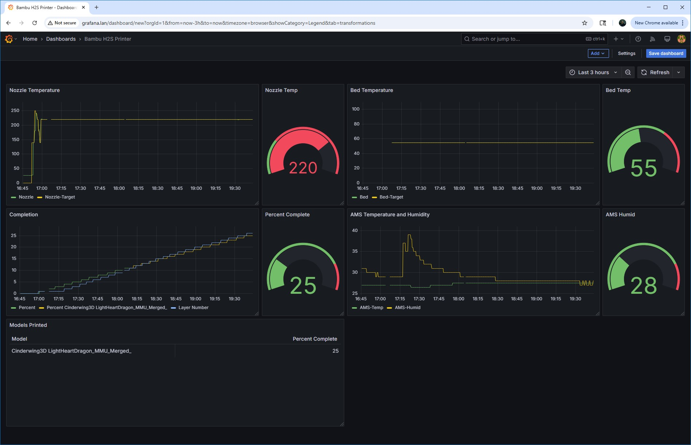

# BAMBULABS EXPORTER
This is an exporter to export metrics from Bambu Lab printers into the Prometheus/Grafana observability stack. Scott uses this with his H2S. It might work on others.

`Used with Firmware ...TODO... on Scott's H2S`





# History

I started with https://github.com/Aetrius/Bambulabs-Exporter/ but had a few problems, and I rewrote and simplified (well, simpler to me, at least) some of the
code. I updated the schema to reflect the latest firmware (as of 10/2025) on my H2S.


### Prometheus Metrics Available

[Sample Metrics Here](sample.md)
| Metric   | Description | Examples |
| ------------- | ------------- |  ------------- |
| ams_humidity_metric  | Humdity of the Enclosure, includes the AMS Number 0-many  | |
| ams_temp_metric  | *Temperature of the AMS, includes the AMS Number 0-many | |
| ams_tray_color_metric | *Filament color in the AMS, includes the AMS Number 0-many & Tray Numbers 0-4 | |
| ams_bed_temp_metric | *Temperature of the AMS bed, includes the AMS Number 0-many & Tray Numbers 0-4 | |
| big_fan1_speed_metric | Big1 Fan Speed  | |
| big_fan2_speed_metric | Big2 Fan Speed  | |
| chamber_temper_metric | Temperature of the Bambu Enclosure  | |
| cooling_fan_speed_metric | Print Head Cooling Fan Speed  | |
| fail_reason_metric | Failure Print Reason Code  | |
| fan_gear_metric | Fan Gear   | |
| layer_number_metric | GCode Layer Number of the Print  | |
| mc_percent_metric | Print Progress in Percentage  | |
| mc_print_error_code_metric | Print Progress Error Code | |
| mc_print_stage_metric | Print Progress Stage | |
| mc_print_sub_stage_metric | Print Progress Sub Stage | |
| mc_remaining_time_metric | Print Progress Remaining Time in minutes  | |
| nozzle_target_temper_metric |Nozzle Target Temperature Metric | |
| nozzle_temper_metric | Nozzle Temperature Metric | |
| print_error_metric | Print Error reported by the Control board | |
| wifi_signal_metric | Wifi Signal Strength in dBm | |

---

## Steps to run the exporter

Scott uses it with Helm and Kubernetes.

Configure it by adding some values overrides. See charts/.../values.yaml to see what needs changing.

## Building

There's a makefile.

- `make build` build a local binary.

- `make docker-build`. build the docker imate.

- `make docker-push`. push the docker image (edit the Makefile to change the repository and version, please)

You can easily test this locally by running `make build`, running the binary, and then
doing a `curl http://localhost:9101/metrics`. 

Make sure to edit the `.env` file to configure the settings for your printer. Note that `.env` is used only
for local testing. For Helm/Kubernetes, use a values.yaml like the good devops person we know you are.

---

### Credit
```
Originally from https://github.com/Aetrius/Bambulabs-Exporter/
```

---

### Support Questions 

```
yeah, right... Maybe go back to Tyler's original repo and ask him.
```
